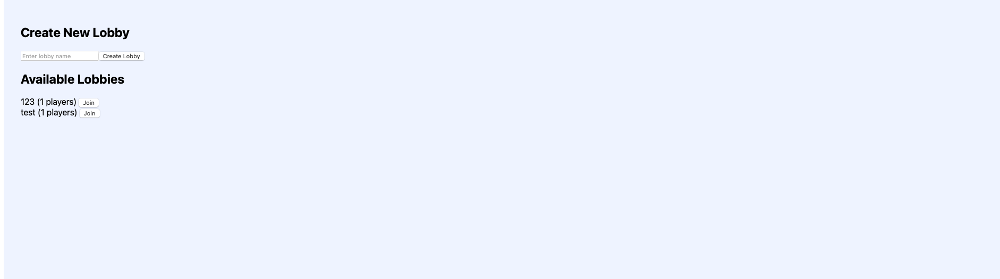
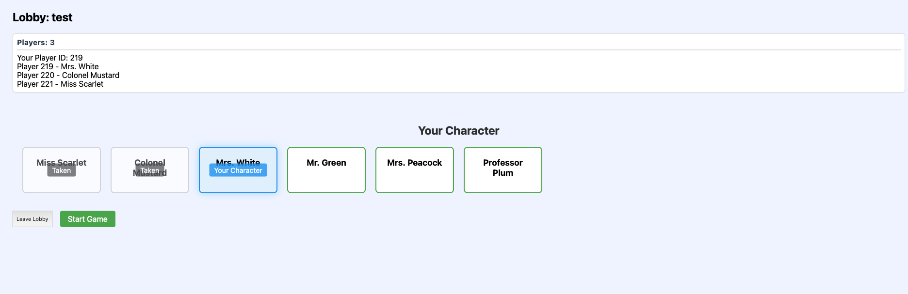

# ClueLess — Mystery Gang

**Final project for EN.605.601 Foundations of Software Engineering**

A web version of the classic board game **Clue**. Players join a lobby, pick a character (each with a fixed starting position on the board), take turns moving, making suggestions, and—when ready—accusations. All game events are broadcast in real time over **WebSockets** so everyone stays in sync.

---

## Project Description

ClueLess is a multiplayer Clue implementation built for the browser. It uses a **React** frontend and a **Django Channels** backend with **Daphne** (ASGI). Communication between clients and the server is done via **WebSockets**, so moves, suggestions, accusations, and disproofs are pushed to all players as they happen.

**Game flow:** Lobby → **Select character** (static starting positions) → **Move** → **Suggestion** (and disproof) → **Accusation** → game state and feed updates are **broadcast** to all connected players.

---

## How the Game Plays

- **Players:** The game supports **3–6 players**. Once there are more than 3 players in the lobby and everyone has chosen a character, the host can start the game (maximum 6 players at a time).

- **Goal:** Solve the mystery by figuring out **which character used which weapon in which room**. The solution is one suspect, one weapon, and one room; players use suggestions and their scoresheet to narrow it down, then make an accusation when they’re ready.

- **Movement:** On your turn you move your character along the board. You can move between **rooms** and **hallways**. Each hallway holds at most one player, so you can’t move into an occupied hallway. Characters have **fixed starting positions** (e.g. Miss Scarlet, Colonel Mustard, etc. each start in a specific hallway).

- **Suggestion:** When you end your move in a **room**, you must make a **suggestion**: you name a suspect, a weapon, and the room you’re in. The suggested suspect (if in the game and not eliminated) is **moved into that room**. The game then looks for someone who can **disprove** the suggestion.

- **Disproof:** After a suggestion, play proceeds in turn order. The **first player after you** who has at least one of the suggested cards (suspect, weapon, or room) must **disprove** by choosing one of those cards to reveal. That disproves the suggestion and gives you (and others) a clue about what’s *not* in the solution. If no one can disprove, the suggestion stands without a disproof.

- **Accusation:** When it’s your turn, you may make an **accusation** instead of (or in addition to) moving/suggesting: you state the exact suspect, weapon, and room you believe are the solution.
  - **Correct accusation** → You win the game.
  - **Wrong accusation** → You are **eliminated** and take no further turns. If only one player remains (everyone else eliminated), that player wins by **last player standing**.

- **Winning:** You win by making the **correct accusation** (right suspect, weapon, and room), or by being the **last player left** after everyone else has been eliminated by a wrong accusation.

---

## Screenshots

**Lobby**



**Character selection**



**Game board**


**Suggestion, accusation & scoresheet**


---

## Tech Stack

- **Frontend:** React (Vite), WebSocket client
- **Backend:** Django, Django Channels, Daphne (ASGI)
- **Real-time:** WebSockets for lobby, game state, moves, suggestions, accusations, and broadcast updates

---

## How to Run

### 1. Backend (from project root)

```bash
# Create and activate a virtual environment (one-time)
python -m venv .venv
source .venv/bin/activate   # macOS/Linux
# .venv\Scripts\Activate.ps1   # Windows PowerShell

# Install dependencies
pip install -r requirements.txt

# Apply migrations
python backend/manage.py migrate

# Start the ASGI server (Django + Channels on port 8000)
cd backend && daphne backend.asgi:application
```

### 2. Frontend (in a separate terminal)

```bash
cd frontend
npm install   # one-time
npm run dev
```

Open the URL shown by Vite (e.g. `http://localhost:5173`) and ensure the backend is running so WebSocket connections work.

---

## Repository

GitHub for **EN.605.601.81.FA25** — Mystery Gang.
